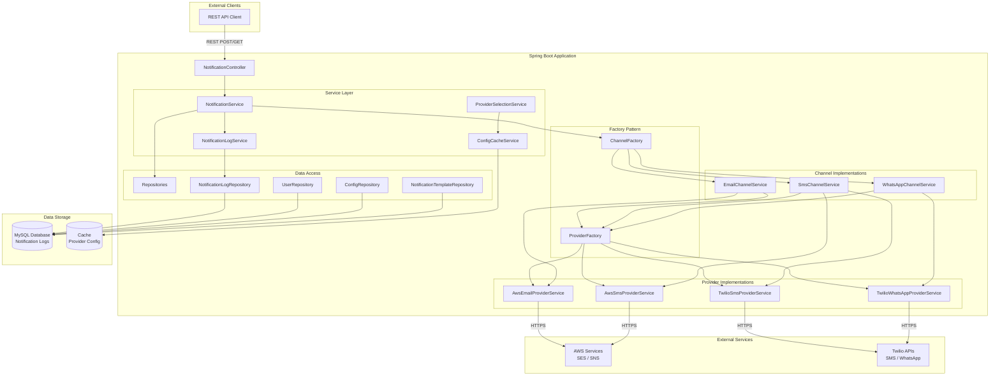
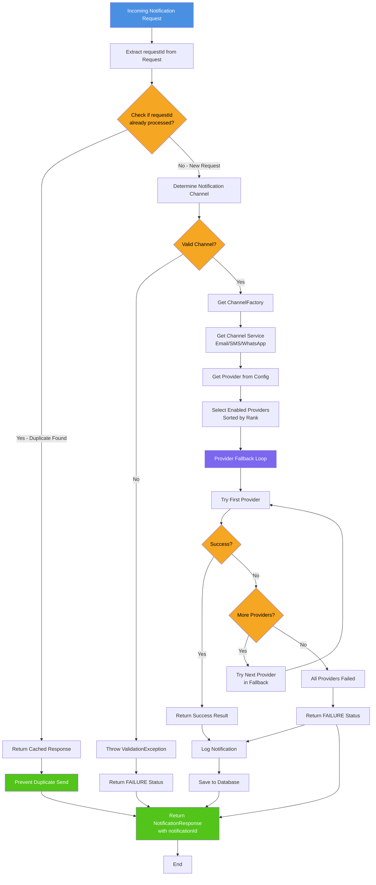
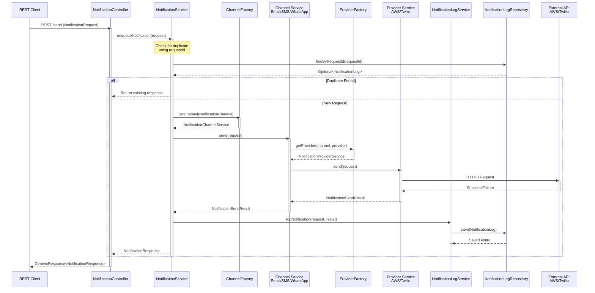
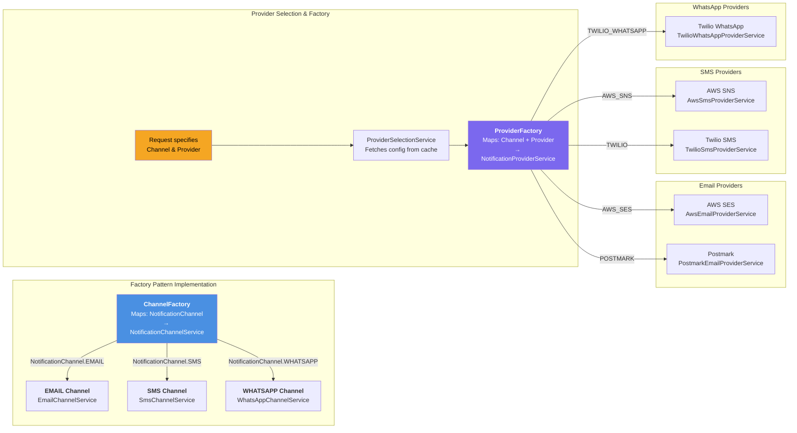
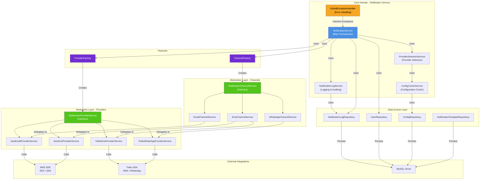
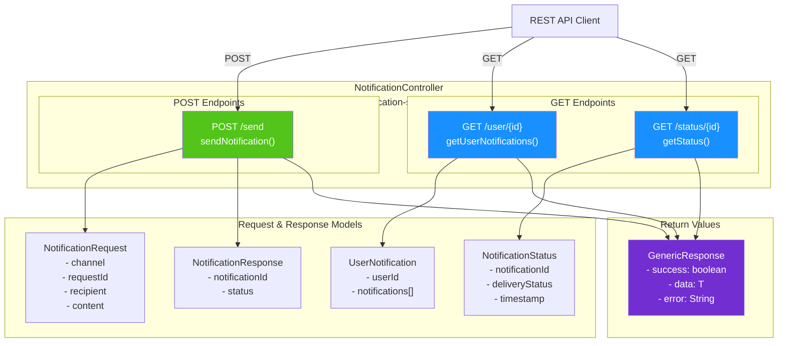
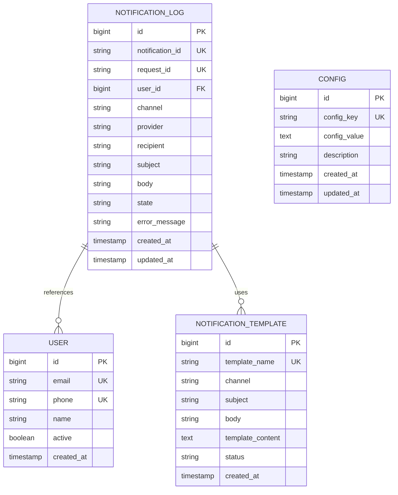
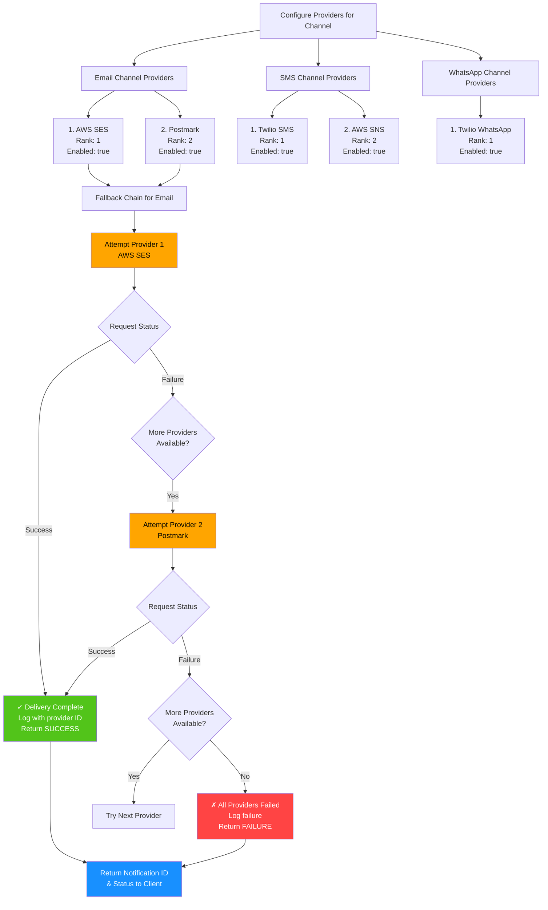

# 🏗️ Notification Service - System Architecture

This document provides comprehensive visual representations of the Notification Service architecture using Mermaid diagrams. Each diagram illustrates different aspects of the system design, from high-level overviews to detailed component interactions.

---

## Table of Contents

1. [High-Level System Architecture](#1-high-level-system-architecture)
2. [Request Processing Flow](#2-request-processing-flow)
3. [Sequence Diagram - Notification Sending](#3-sequence-diagram--notification-sending)
4. [Factory Pattern Implementation](#4-factory-pattern-implementation)
5. [Service Layer Architecture](#5-service-layer-architecture)
6. [REST API Endpoints](#6-rest-api-endpoints)
7. [Database Schema Overview](#7-database-schema-overview)
8. [Provider Fallback Logic](#8-provider-fallback-logic)

---

## 1. High-Level System Architecture

This diagram shows the complete system architecture, including all layers from REST clients through Spring Boot services to external providers and databases.



### Key Components:
- **NotificationController**: REST API entry point
- **NotificationService**: Core orchestration and deduplication logic
- **ChannelFactory**: Maps notification channels to implementations
- **ProviderFactory**: Maps channels and providers to service implementations
- **Channel Services**: Email, SMS, and WhatsApp implementations
- **Provider Services**: AWS and Twilio integrations
- **Repositories**: Data access layer for persistence
- **External Services**: AWS (SES/SNS) and Twilio APIs
- **Database**: MySQL for notification logs and configuration
- **Cache**: In-memory provider configuration cache

---

## 2. Request Processing Flow

This flowchart illustrates the complete lifecycle of a notification request, including deduplication checks, channel selection, provider fallback, and logging.



### Flow Description:

**Request Deduplication:**
- Every request must include a unique `requestId`
- System checks if this `requestId` was previously processed
- If yes, returns cached response (idempotent operation)
- If no, proceeds with new notification

**Channel & Provider Selection:**
- Validates requested notification channel (EMAIL, SMS, WHATSAPP)
- Uses `ChannelFactory` to get appropriate channel service
- Retrieves enabled providers from configuration (cached for performance)
- Providers are sorted by rank/priority

**Provider Fallback Mechanism:**
- Attempts to send via primary provider (highest rank)
- If primary fails, automatically tries secondary provider
- Continues fallback chain until success or all providers exhausted
- Logs all attempts with detailed error information

**Logging & Persistence:**
- All notification attempts are logged to `NotificationLog` entity
- Includes request metadata, channel, provider, status, and timestamps
- Enables audit trail and future status queries

---

## 3. Sequence Diagram – Notification Sending

This sequence diagram shows the detailed interaction flow between components during notification sending.



### Interaction Steps:

1. **Request Reception**: Client sends POST request to NotificationController
2. **Deduplication Check**: Verify requestId hasn't been processed before
3. **Channel Resolution**: Get appropriate channel service from factory
4. **Provider Selection**: Get provider service for the channel
5. **External API Call**: Send request to AWS/Twilio with appropriate credentials
6. **Response Reception**: Capture provider response and status
7. **Logging**: Create permanent record in NotificationLog
8. **Response Return**: Return notification result to client

---

## 4. Factory Pattern Implementation

This diagram shows how the Factory Pattern enables flexible and extensible channel/provider selection.



### Benefits:

- **Loose Coupling**: Channels and providers are loosely coupled
- **Extensibility**: Easy to add new channels or providers
- **Maintainability**: Changes to implementations don't affect factory
- **Single Responsibility**: Each factory handles one type of mapping
- **Runtime Selection**: Dynamic provider/channel selection based on configuration

### Example Usage:

```java
// Get channel service
NotificationChannelService channel = channelFactory.getChannel(NotificationChannel.EMAIL);

// Get provider service
NotificationProviderService provider = providerFactory.getProviderService(
    NotificationChannel.EMAIL, 
    NotificationProvider.AWS_SES
);
```

---

## 5. Service Layer Architecture

This diagram shows the complete service layer with all dependencies and interactions.



### Service Responsibilities:

**NotificationService**
- Main orchestrator and entry point
- Handles request deduplication
- Routes to appropriate channels
- Manages notification lifecycle

**NotificationLogService**
- Persists notification audit logs
- Tracks delivery status
- Enables notification history queries

**ProviderSelectionService**
- Retrieves provider configurations
- Filters enabled providers
- Sorts by priority/rank

**ConfigCacheService**
- Caches provider configurations
- Reduces database queries
- Improves performance

**GlobalExceptionHandler**
- Centralized error handling
- Custom exception translation
- Standardized error responses

---

## 6. REST API Endpoints

This diagram shows the REST API structure and data models.



### Endpoints Summary:

**POST /notifications/send**
- Send a new notification
- Request: `NotificationRequest` with channel, recipient, content, requestId
- Response: `NotificationResponse` with unique notificationId and status

**GET /notifications/user/{userId}**
- Retrieve all notifications for a user
- Returns: `UserNotification` with list of notification logs

**GET /notifications/status/{notificationId}**
- Check delivery status of specific notification
- Returns: `NotificationStatus` with current delivery state

---

## 7. Database Schema Overview

This section provides an overview of the core database entities and their relationships.

### Core Entities

#### NOTIFICATION_LOG (Primary Audit Entity)
The central entity for tracking all notification attempts and delivery status.

| Field | Type | Constraints | Description |
|-------|------|-------------|-------------|
| `id` | bigint | PK | Primary key, auto-incremented |
| `notification_id` | string | UK | UUID unique identifier for tracking |
| `request_id` | string | UK | Client-provided ID for deduplication |
| `user_id` | bigint | FK | Reference to USER entity |
| `channel` | string | - | EMAIL, SMS, or WHATSAPP |
| `provider` | string | - | AWS_SES, TWILIO, AWS_SNS, POSTMARK |
| `recipient` | string | - | Email address, phone number, or WhatsApp ID |
| `subject` | string | - | Subject/message title |
| `body` | text | - | Message content |
| `state` | string | - | SUCCESS, FAILURE, PENDING |
| `error_message` | string | - | Error details if failed |
| `created_at` | timestamp | - | Automatic creation timestamp |
| `updated_at` | timestamp | - | Automatic update timestamp |

**Purpose**: Maintains complete audit trail of all notification attempts for compliance, debugging, and status tracking.

---

#### USER Entity
Stores recipient information for notification tracking.

| Field | Type | Constraints | Description |
|-------|------|-------------|-------------|
| `id` | bigint | PK | Primary key, auto-incremented |
| `name` | string | - | User's full name |
| `email` | string | UK | Unique email address |
| `phone` | string | UK | Unique phone number |
| `active` | boolean | - | User account status |
| `created_at` | timestamp | - | Account creation date |

**Purpose**: Maintains user profile information referenced by notification logs.

---

#### NOTIFICATION_TEMPLATE Entity
Pre-defined message templates with variable placeholders (prepared for future template-based notifications).

| Field | Type | Constraints | Description |
|-------|------|-------------|-------------|
| `id` | bigint | PK | Primary key, auto-incremented |
| `template_name` | string | UK | Unique template identifier |
| `channel` | string | - | EMAIL, SMS, or WHATSAPP |
| `subject` | string | - | Email/notification subject |
| `body` | text | - | Template body with placeholders {{var}} |
| `template_content` | text | - | Full template JSON |
| `status` | string | - | ACTIVE, INACTIVE, DEPRECATED |
| `created_at` | timestamp | - | Template creation date |

**Purpose**: Stores reusable message templates for template-based notifications (future feature).

**Example Template**:
```
Template Name: WELCOME_EMAIL
Channel: EMAIL
Subject: Welcome {{userName}}!
Body: Dear {{userName}}, thank you for joining us...
```

---

#### CONFIG Entity
Dynamic configuration storage for provider settings and ranks.

| Field | Type | Constraints | Description |
|-------|------|-------------|-------------|
| `id` | bigint | PK | Primary key, auto-incremented |
| `config_key` | string | UK | Configuration key identifier |
| `config_value` | text | - | Configuration value (often JSON) |
| `description` | string | - | Configuration description |
| `created_at` | timestamp | - | Configuration creation date |
| `updated_at` | timestamp | - | Last modification date |

**Purpose**: Stores dynamic configurations without code changes, including provider rankings and enabled states.

**Example Configuration**:
```json
{
  "config_key": "EMAIL_PROVIDERS",
  "config_value": {
    "providers": [
      {
        "name": "AWS_SES",
        "enabled": true,
        "rank": 1
      },
      {
        "name": "POSTMARK",
        "enabled": true,
        "rank": 2
      }
    ]
  }
}
```

---

### Entity Relationships

```
USER (1) ──────────────────── (N) NOTIFICATION_LOG
         
NOTIFICATION_TEMPLATE (1) ──────────────────── (N) NOTIFICATION_LOG (optional)

CONFIG (stores) provider rankings and settings for use by ProviderSelectionService
```

### Indexing Strategy

For optimal query performance, create indexes on:

```sql
-- Deduplication lookup
CREATE INDEX idx_notification_log_request_id ON notification_log(request_id);

-- User history queries
CREATE INDEX idx_notification_log_user_id ON notification_log(user_id);

-- Status tracking
CREATE INDEX idx_notification_log_notification_id ON notification_log(notification_id);

-- Provider performance analysis
CREATE INDEX idx_notification_log_provider ON notification_log(provider, state);

-- Time-based queries
CREATE INDEX idx_notification_log_created_at ON notification_log(created_at);
```

---

### Database Schema Diagram



### Data Retention & Cleanup

- **NOTIFICATION_LOG**: Keep for 90 days or longer for compliance
- **USER**: Keep indefinitely unless user requests deletion
- **NOTIFICATION_TEMPLATE**: Keep active/deprecated versions for reference
- **CONFIG**: Keep as is, configurations are historical

**Cleanup Strategy**:
```sql
-- Archive old notification logs (quarterly)
DELETE FROM notification_log WHERE created_at < DATE_SUB(NOW(), INTERVAL 90 DAY);

-- Verify user still active before cleanup
DELETE FROM user WHERE active = false AND updated_at < DATE_SUB(NOW(), INTERVAL 1 YEAR);
```

---

## 8. Provider Fallback Logic

Detailed breakdown of the intelligent provider fallback mechanism.



### Fallback Mechanism Benefits:

- **High Availability**: Service continues if primary provider fails
- **Automatic Retry**: No manual intervention needed
- **Transparent to Client**: Client sees success if any provider succeeds
- **Configurable Priority**: Administrators control provider ranking
- **Complete Logging**: All attempts logged for debugging

### Configuration Example:

```json
{
  "group": "CHANNEL_PROVIDERS",
  "key": "EMAIL",
  "value": {
    "providers": [
      {
        "name": "AWS_SES",
        "enabled": true,
        "rank": 1,
        "config": {
          "region": "us-east-1",
          "from_address": "noreply@example.com"
        }
      },
      {
        "name": "POSTMARK",
        "enabled": true,
        "rank": 2,
        "config": {
          "api_key": "xxx-xxx-xxx"
        }
      }
    ]
  }
}
```

---

## Design Patterns Used

### 1. Factory Pattern
- **ChannelFactory**: Creates channel implementations dynamically
- **ProviderFactory**: Creates provider implementations dynamically
- Enables loose coupling and easy extensibility

### 2. Strategy Pattern
- **NotificationChannelService**: Strategy interface for channels
- **NotificationProviderService**: Strategy interface for providers
- Allows runtime selection of implementation

### 3. Repository Pattern
- **Spring Data JPA Repositories**: Abstraction for data access
- Enables easy switching between different persistence layers

### 4. Dependency Injection
- Spring Framework's IoC container manages all dependencies
- Constructor injection for required dependencies
- Loose coupling between components

### 5. Template Method Pattern
- **BaseEntity**: Abstract base class with audit fields
- **GlobalExceptionHandler**: Centralized exception handling

### 6. Observer Pattern (Implicit)
- Configuration changes can trigger cache invalidation
- Providers can be monitored for availability

---

## Data Flow Summary

```
Client Request
    ↓
NotificationController (REST endpoint)
    ↓
NotificationService (Orchestration)
    ├→ Check Deduplication (RequestId lookup)
    ├→ ChannelFactory (Get channel service)
    ├→ ProviderSelectionService (Get providers)
    ├→ Provider Fallback Loop
    │   ├→ Try Primary Provider
    │   ├→ If fail, try Secondary Provider
    │   └→ Continue until success/all fail
    ├→ NotificationLogService (Log attempt)
    └→ Return Response
    ↓
Database (Persist NotificationLog)
    ↓
Client Response
```

---

## Scalability Considerations

1. **Database Indexing**: Create indexes on requestId and userId for fast lookups
2. **Connection Pooling**: HikariCP handles database connections efficiently
3. **Provider Caching**: ConfigCacheService reduces database queries
4. **Async Processing**: Future Kafka integration for asynchronous sending
5. **Load Balancing**: Multiple instances can handle concurrent requests
6. **Provider Rate Limiting**: Monitor and respect provider rate limits

---

## Security Considerations

1. **Authentication**: Validate API requests (implement OAuth2/JWT)
2. **Authorization**: Verify users can only access their notifications
3. **Data Encryption**: Encrypt sensitive data (phone numbers, email addresses)
4. **Credential Management**: Store provider credentials securely (AWS Secrets Manager)
5. **Input Validation**: Validate all incoming request data
6. **HTTPS Only**: All external communications are HTTPS
7. **Audit Logging**: Complete audit trail in NotificationLog table

---

## Monitoring & Observability

1. **Metrics**: Track success/failure rates per provider
2. **Logging**: Structured logging with SLF4J/Logback
3. **Health Checks**: Spring Actuator provides application health endpoints
4. **Provider Health**: Monitor provider connectivity and availability
5. **Database Performance**: Monitor query performance and connection pool

---

## Future Enhancements

1. **Template-Based Notifications**: Support pre-configured message templates
2. **Kafka Integration**: Asynchronous notification processing
3. **Rate Limiting**: Per-user and per-provider rate limits
4. **Webhook Callbacks**: Provider delivery confirmations via webhooks
5. **Batch Processing**: Send multiple notifications in single request
6. **Notification Scheduling**: Schedule notifications for future delivery
7. **A/B Testing**: Compare provider performance
8. **Admin Dashboard**: Web UI for configuration management

---

**Document Version**: 1.0  
**Last Updated**: April 2026  
**Status**: Active
