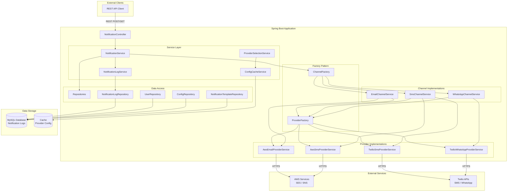
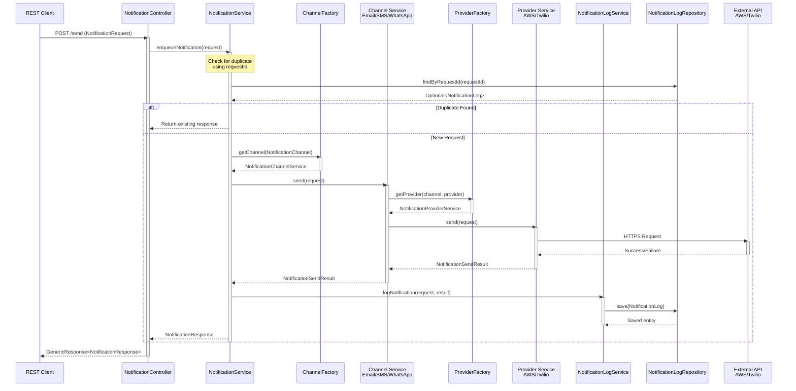
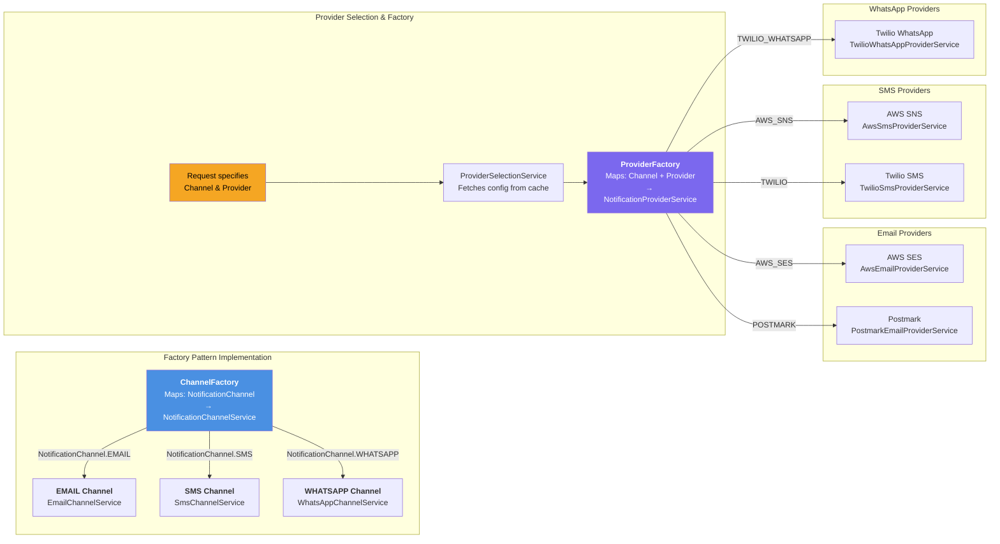
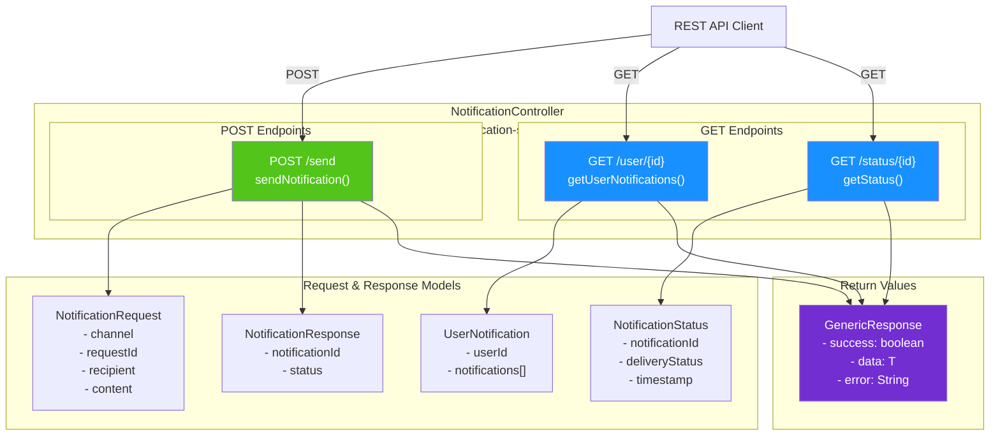
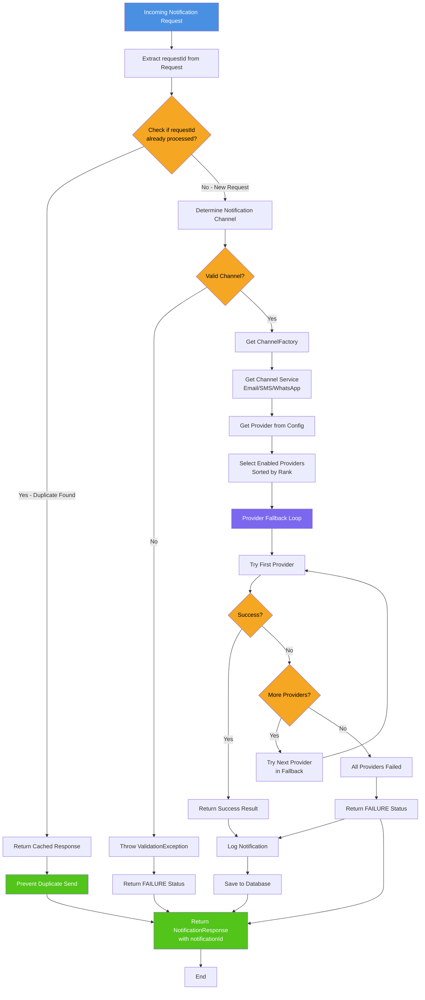
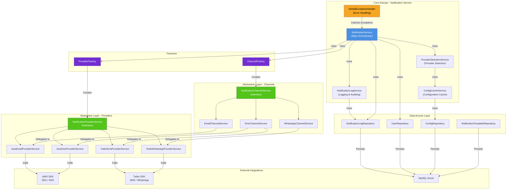

# 📬 Notification Service

A robust, enterprise-grade multi-channel notification microservice built with Spring Boot that enables seamless sending of notifications across Email, SMS, and WhatsApp platforms.

## 🎯 Overview

The Notification Service is a production-ready microservice designed to handle notification delivery across multiple channels with high reliability and scalability. It provides a unified REST API for sending notifications through different providers while featuring intelligent provider selection, automatic fallback mechanisms, request deduplication, and comprehensive notification tracking.

**Project Metadata:**
- **Group ID:** `com.axd`
- **Artifact ID:** `notification-service`
- **Version:** `0.0.1-SNAPSHOT`
- **Java Version:** 21
- **Spring Boot Version:** 3.5.7
- **API Base Path:** `/notification-service`

---

## ✨ Key Features

### 📤 Multi-Channel Support
- **Email Channel:** AWS SES, Postmark
- **SMS Channel:** Twilio, AWS SNS
- **WhatsApp Channel:** Twilio (Rich media & interactive templates)

### 🚀 Core Capabilities
- **Direct Content Delivery:** Send custom messages with full control over content
- **Request Deduplication:** Prevent duplicate sends using unique `requestId`
- **Intelligent Provider Selection:** Automatic ranking and provider selection with fallback mechanisms
- **Notification History:** Complete audit trail of all sent notifications
- **User Notification Tracking:** Query notifications by user ID
- **Status Retrieval:** Real-time notification delivery status

### 🏗️ Architecture & Design Patterns
- **Factory Pattern:** ChannelFactory and ProviderFactory for extensible channel/provider creation
- **Strategy Pattern:** NotificationChannelService implementations for different channels
- **Service Layer Architecture:** Clean separation of concerns with dedicated service classes
- **Error Handling:** Global exception handler with custom exception hierarchy

### 💻 Technology Stack
- **Framework:** Spring Boot 3.5.7 with Spring Web, Data JPA
- **Database:** MySQL 8.0 with Hibernate ORM
- **Cloud Services:** AWS SDK (SES for Email, SNS for SMS)
- **Third-Party APIs:** Twilio SDK (SMS & WhatsApp)
- **APIs & Documentation:** SpringDoc OpenAPI/Swagger 3.0
- **Build Tool:** Maven 3.6+
- **Code Generation:** Project Lombok
- **Monitoring:** Spring Boot Actuator

---

## 🛠️ Prerequisites

Before working with this project, ensure you have the following installed:

- **Java 21** - [Download from Oracle](https://www.oracle.com/java/technologies/downloads/#java21)
- **Maven 3.6+** - [Installation Guide](https://maven.apache.org/install.html)
- **MySQL 8.0+** - [Download MySQL](https://dev.mysql.com/downloads/mysql/)
- **Git** - For version control

### Third-Party Credentials (Optional)
- **AWS Account** - For SES and SNS services
- **Twilio Account** - For SMS and WhatsApp
- **Postmark Account** - For alternative email service

---

## 📦 Installation & Quick Start

### 1️⃣ Clone the Repository

```bash
git clone https://github.com/amanxdeep/notification-service.git
cd notification-service
```

### 2️⃣ Configure Database Connection

Edit `src/main/resources/application.properties`:

```properties
spring.datasource.url=jdbc:mysql://localhost:3306/notification_db
spring.datasource.username=root
spring.datasource.password=yourpassword
spring.jpa.hibernate.ddl-auto=update
spring.jpa.show-sql=false
```

### 3️⃣ Configure External Services (Optional)

Add your credentials in `application.properties`:

```properties
# AWS Configuration
aws.region=us-east-1
aws.ses.access-key=YOUR_AWS_KEY
aws.ses.secret-key=YOUR_AWS_SECRET

# Twilio Configuration  
twilio.account-sid=YOUR_ACCOUNT_SID
twilio.auth-token=YOUR_AUTH_TOKEN
twilio.phone-number=YOUR_TWILIO_NUMBER

### 4️⃣ Build the Project

```bash
mvn clean install
```

This will:
- Compile the source code
- Download dependencies
- Run unit tests
- Generate the executable JAR

### 5️⃣ Run the Application

```bash
mvn spring-boot:run
```

Or execute the JAR directly:

```bash
java -jar target/notification-service-0.0.1-SNAPSHOT.jar
```

The application will start on: `http://localhost:8080/notification-service`

### ✅ Verify Installation

Check application health:
```bash
curl http://localhost:8080/notification-service/actuator/health
```

Access Swagger API Documentation:
```
http://localhost:8080/notification-service/swagger-ui.html
```

---

## 📋 REST API Endpoints

All endpoints are prefixed with `/notification-service/notifications`

### 1. Send Notification

**POST** `/notifications/send`

Send a notification via specified channel with direct content.

**Example Request:**
```json
{
  "requestId": "req-unique-67890",
  "userId": 2,
  "type": "DIRECT_CONTENT",
  "channel": "SMS",
  "data": {
    "phoneNumber": "+1234567890",
    "message": "Your verification code is: 123456"
  }
}
```

**Response (200 OK):**
```json
{
  "success": true,
  "data": {
    "notificationId": "550e8400-e29b-41d4-a716-446655440000",
    "status": "SUCCESS"
  }
}
```

---

### 2. Retrieve User Notifications

**GET** `/notifications/user/{userId}`

Fetch all notifications sent to a specific user.

**Response (200 OK):**
```json
{
  "success": true,
  "data": {
    "userId": 1,
    "notifications": [
      {
        "id": 1,
        "notificationId": "550e8400-e29b-41d4-a716-446655440000",
        "channel": "EMAIL",
        "provider": "AWS_SES",
        "state": "SUCCESS",
        "createdAt": "2026-03-03T10:30:00"
      },
      {
        "id": 2,
        "notificationId": "660e8401-e29b-41d4-a716-446655440001",
        "channel": "SMS",
        "provider": "TWILIO",
        "state": "PENDING",
        "createdAt": "2026-03-03T10:35:00"
      }
    ]
  }
}
```

---

### 3. Get Notification Status

**GET** `/notifications/status/{notificationId}`

Check the delivery status of a specific notification.

**Response (200 OK):**
```json
{
  "success": true,
  "data": {
    "status": "SUCCESS"
  }
}
```

---

## 🔌 Supported Channels & Providers

### Email Channel 📧
- **AWS SES (Simple Email Service)**
  - Enterprise-grade deliverability
  - Cost-effective for high volume
  - Sandbox and production modes
  - Rank: Primary (1)

- **Postmark**
  - Developer-friendly API
  - Excellent delivery support
  - Real-time issue alerts
  - Rank: Secondary (2)

### SMS Channel 📱
- **Twilio SMS**
  - Global SMS delivery
  - Comprehensive routing
  - Webhook support for status updates
  - Rank: Primary (1)

- **AWS SNS (Simple Notification Service)**
  - AWS-integrated solution
  - Multi-channel support
  - Cost-effective
  - Rank: Secondary (2)

### WhatsApp Channel 💬
- **Twilio WhatsApp Business API**
  - Rich media messaging (images, PDFs)
  - Interactive message templates
  - Two-way conversations
  - Rank: Primary (1)

---

## 🏗️ Project Architecture

### Directory Structure
```
notification-service/
├── src/
│   ├── main/
│   │   ├── java/com/axd/notificationService/
│   │   │   ├── channel/                          # Channel implementations (Email, SMS, WhatsApp)
│   │   │   │   ├── implementations/
│   │   │   │   │   ├── EmailChannelService.java
│   │   │   │   │   ├── SmsChannelService.java
│   │   │   │   │   └── WhatsAppChannelService.java
│   │   │   │   └── NotificationChannelService.java
│   │   │   ├── config/                           # Configuration classes for AWS, Twilio
│   │   │   │   ├── AwsSesConfig.java
│   │   │   │   ├── AwsSnsConfig.java
│   │   │   │   ├── TwilioConfig.java
│   │   │   │   ├── WebClientConfig.java
│   │   │   │   └── NotificationChannelConfig.java
│   │   │   ├── controller/                       # REST Controllers
│   │   │   │   └── NotificationController.java
│   │   │   ├── enums/                            # Enumeration classes
│   │   │   │   ├── NotificationChannel.java      # EMAIL, SMS, WHATSAPP
│   │   │   │   ├── NotificationProvider.java     # AWS_SES, TWILIO_SMS, etc.
│   │   │   │   ├── NotificationType.java         # DIRECT_CONTENT (only currently supported)
│   │   │   │   ├── NotificationRequestStatus.java
│   │   │   │   └── LogContextKey.java
│   │   │   ├── exceptions/                       # Exception handling
│   │   │   │   ├── AbstractException.java
│   │   │   │   ├── ValidationException.java
│   │   │   │   ├── ResourceNotFoundException.java
│   │   │   │   └── handler/GlobalExceptionsHandler.java
│   │   │   ├── factory/                          # Factory pattern implementations
│   │   │   │   ├── ChannelFactory.java
│   │   │   │   └── ProviderFactory.java
│   │   │   ├── model/                            # Data models
│   │   │   │   ├── entity/
│   │   │   │   │   ├── BaseEntity.java           # Audit fields (createdAt, updatedAt)
│   │   │   │   │   ├── User.java
│   │   │   │   │   ├── NotificationLog.java
│   │   │   │   │   ├── NotificationTemplate.java
│   │   │   │   │   └── ConfigEntity.java
│   │   │   │   ├── dto/                          # Data Transfer Objects
│   │   │   │   │   ├── request/NotificationRequest.java
│   │   │   │   │   ├── response/
│   │   │   │   │   │   ├── GenericResponse.java
│   │   │   │   │   │   ├── NotificationResponse.java
│   │   │   │   │   │   ├── NotificationStatus.java
│   │   │   │   │   │   └── UserNotification.java
│   │   │   │   │   ├── EmailDto.java
│   │   │   │   │   ├── SmsDto.java
│   │   │   │   │   └── WhatsappDto.java
│   │   │   │   └── ProviderConfig.java
│   │   │   ├── provider/                         # Provider implementations
│   │   │   │   ├── NotificationProviderService.java
│   │   │   │   ├── emailProvider/
│   │   │   │   │   └── AwsEmailProviderService.java
│   │   │   │   ├── smsProvider/
│   │   │   │   │   ├── AwsSmsProviderService.java
│   │   │   │   │   └── TwilioSmsProviderService.java
│   │   │   │   └── whatsAppProvider/
│   │   │   │       └── TwilioWhatsAppProviderService.java
│   │   │   ├── repository/                       # Database access layer (Spring Data JPA)
│   │   │   │   ├── UserRepository.java
│   │   │   │   ├── NotificationLogRepository.java
│   │   │   │   ├── NotificationTemplateRepository.java
│   │   │   │   └── ConfigRepository.java
│   │   │   ├── service/                          # Business logic layer
│   │   │   │   ├── NotificationService.java      # Core orchestration service
│   │   │   │   ├── NotificationLogService.java   # Audit and history
│   │   │   │   ├── ConfigCacheService.java       # Configuration caching
│   │   │   │   └── ProviderSelectionService.java # Intelligent provider selection
│   │   │   ├── util/                             # Utility classes
│   │   │   │   ├── TemplateRenderer.java         # Template variable substitution
│   │   │   │   └── CommonUtils.java              # Common utilities
│   │   │   ├── constants/                        # Application constants
│   │   │   │   ├── AppConstants.java
│   │   │   │   └── ControllerConstants.java
│   │   │   └── NotificationServiceApplication.java  # Main Spring Boot application class
│   │   └── resources/
│   │       └── application.properties            # Application configuration
│   └── test/
│       └── java/com/axd/notificationService/
│           └── NotificationServiceApplicationTests.java
├── pom.xml                                        # Maven build configuration
├── README.md
└── HELP.md
```

---

## 🔑 Key Components Explained

### 🎯 NotificationService
The core orchestration service that:
- Processes incoming notification requests
- Implements request deduplication using unique `requestId` to prevent duplicate sends
- Routes requests to appropriate channels using `ChannelFactory`
- Manages notification status and provides user notification retrieval
- Handles the complete notification lifecycle

### 📦 NotificationChannelService Interface
Abstract contract defining:
- Interface for all communication channel implementations
- Three core implementations: `EmailChannelService`, `SmsChannelService`, `WhatsAppChannelService`
- Delegation to `ProviderSelectionService` for intelligent provider selection
- Support for direct content delivery (template-based notifications coming in future)

### 🏭 Factory Pattern Implementation
**ChannelFactory:**
- Maps `NotificationChannel` enum (EMAIL, SMS, WHATSAPP) to channel service implementations
- Enables loose coupling and easy addition of new channels
- Runtime channel instantiation based on request requirements

**ProviderFactory:**
- Dynamically selects notification providers for each channel
- Loads provider configurations from database
- Supports provider ranking and enabled/disabled states

### 🧠 ProviderSelectionService
Intelligent provider management:
- Retrieves cached provider configurations
- Filters enabled providers for the requested channel
- Sorts providers by configured rank (priority)
- Implements fallback mechanism: if primary provider fails, automatically attempts next provider
- Reduces delivery failures through redundancy

### 📊 NotificationLogService
Comprehensive audit and tracking:
- Logs all notification attempts with complete metadata
- Records delivery status (SUCCESS, FAILURE, PENDING)
- Tracks provider used and provider-specific notification IDs
- Enables notification history queries and debugging
- Supports compliance and regulatory requirements

### 💾 ConfigCacheService
Performance optimization:
- Reduces database hits for frequently accessed configuration
- Automatic cache invalidation strategies
- Minimizes latency for provider selection decisions

---

## � System Architecture Diagrams

### 1. High-Level System Architecture
Comprehensive overview showing the flow from REST clients through Spring Boot to external services:



---

### 2. Notification Sending - Sequence Diagram
Detailed flow showing the complete request lifecycle including deduplication and provider fallback:



---

### 3. Factory Pattern & Provider Architecture
Demonstrates how the factory pattern enables flexible, extensible multi-provider/multi-channel support:



---

### 4. REST API Endpoints & Data Models
Shows the three main API endpoints and their request/response models:



---

### 5. Database Schema - Entity Relationships
Shows the relationships between core entities and their properties:

```mermaid
erDiagram
    NOTIFICATION_LOG ||--o{ USER : "belongs_to"
    NOTIFICATION_LOG ||--o{ NOTIFICATION_TEMPLATE : "uses"
    CONFIG ||--|  CONFIG_KEY : "references"
    NOTIFICATION_LOG {
        bigint id PK
        string notification_id UK
        string request_id UK
        bigint user_id FK
        string channel
        string provider
        string recipient
        string subject
        string body
        string state
        string error_message
        timestamp created_at
        timestamp updated_at
    }
    USER {
        bigint id PK
        string email UK
        string phone UK
        string name
        boolean active
        timestamp created_at
    }
    NOTIFICATION_TEMPLATE {
        bigint id PK
        string template_name UK
        string channel
        string subject
        string body
        text template_content
        string status
        timestamp created_at
    }
    CONFIG {
        bigint id PK
        string config_key UK
        text config_value
        string description
        timestamp created_at
        timestamp updated_at
    }
    CONFIG_KEY {
        string key_name PK
        string description
    }
```

---

### 6. Request Processing Flow - Deduplication & Fallback
Detailed flowchart showing the complete request handling logic including duplicate detection and provider fallback:



---

### 7. Service Layer Architecture & Dependencies
Comprehensive view of the service layer showing dependencies and integration points:



---

## �🗄️ Database Schema

All entities extend `BaseEntity` which provides audit fields (`createdAt`, `updatedAt`).

### User Entity
```java
@Entity
public class User extends BaseEntity {
    private Long id;
    private String name;
}
```
Stores user information for tracking notification recipients.

### NotificationLog Entity ⭐
```java
@Entity
public class NotificationLog extends BaseEntity {
    private Long id;
    private String requestId;              // Unique identifier for deduplication
    private String notificationId;         // UUID generated for each notification
    private Long userId;                   // Recipient user
    private String eventId;                // Business event identifier
    private String type;                   // DIRECT_CONTENT (TEMPLATE_BASED coming soon)
    private String channel;                // EMAIL, SMS, or WHATSAPP
    private String provider;               // AWS_SES, TWILIO_SMS, POSTMARK, etc.
    private String providerNotificationId; // Provider's response ID for tracking
    private String state;                  // SUCCESS, FAILURE, PENDING
}
```
Core entity tracking all notification attempts, outcomes, and provider information.

### NotificationTemplate Entity
```java
@Entity
public class NotificationTemplate extends BaseEntity {
    private Long id;
    private String type;        // Template type (e.g., WELCOME_EMAIL, OTP_SMS)
    private String channel;     // EMAIL, SMS, or WHATSAPP
    private String subject;     // Subject line for email templates
    private String bodyTemplate; // Template body with placeholders: {{userName}}, {{link}}, etc.
}
```
⚠️ **Note:** Template-based notifications are currently planned for future implementation. This entity structure is prepared for the feature.

### ConfigEntity (Configuration)
```java
@Entity
@Table(name = "config")
public class ConfigEntity extends BaseEntity {
    private Long id;
    @Column(name = "`group`")
    private String group;        // Configuration group (EMAIL, SMS, WHATSAPP)
    @Column(name = "`key`")
    private String key;          // Configuration key
    private String value;        // Configuration value (often in JSON format)
}
```
Stores dynamic configurations including provider rankings and enabled states.

### BaseEntity (Abstract Base Class)
```java
@MappedSuperclass
public class BaseEntity {
    private LocalDateTime createdAt;    // Automatic timestamp of creation
    private LocalDateTime updatedAt;    // Automatic timestamp of last update
}
```
Provides audit fields for all entities.

### Configuration Storage Example
```json
{
  "group": "CHANNEL_PROVIDERS",
  "key": "EMAIL",
  "value": {
    "providers": [
      {
        "name": "AWS_SES",
        "enabled": true,
        "rank": 1
      },
      {
        "name": "POSTMARK",
        "enabled": true,
        "rank": 2
      }
    ]
  }
}
```

## 📊 Request Processing Flow

The complete request lifecycle from API entry to delivery:

```
1. Receive Notification Request
   POST /notifications/send
   ↓
2. Validate Request Payload
   ├─ Check required fields
   ├─ Validate channel is supported
   └─ Validate notification type
   ↓
3. Check Request Deduplication
   └─→ Query NotificationLog by requestId
       ├─ If found → Return existing notificationId (idempotent)
       └─ If not found → Continue
   ↓
4. Route to Appropriate Channel
   └─→ Use ChannelFactory to get channel implementation
       ├─ NotificationChannel.EMAIL → EmailChannelService
       ├─ NotificationChannel.SMS → SmsChannelService
       └─ NotificationChannel.WHATSAPP → WhatsAppChannelService
   ↓
5. Select Provider via ProviderSelectionService
   ├─ Load cached provider configurations
   ├─ Filter enabled providers for channel
   ├─ Sort by rank/priority
   └─ Return ranked provider list
   ↓
6. Attempt Notification Delivery
   ├─ Try Primary Provider (Rank 1)
   │  ├─ Success → Send notification, capture provider's response ID
   │  └─ Failure → Attempt Fallback Provider
   │
   ├─ Try Secondary Provider (Rank 2)
   │  ├─ Success → Send notification, capture provider's response ID
   │  └─ Failure → Continue fallback chain
   │
   └─ If All Providers Fail → Log failure and return error
   ↓
7. Log Notification Attempt
   ├─ Create NotificationLog entry with:
   │  ├─ requestId (for deduplication)
   │  ├─ notificationId (UUID, unique identifier)
   │  ├─ userId (recipient)
   │  ├─ channel (EMAIL, SMS, WHATSAPP)
   │  ├─ provider (which service succeeded)
   │  ├─ providerNotificationId (external reference)
   │  └─ state (SUCCESS, FAILURE, PENDING)
   ↓
8. Return Response
   {
     "success": true,
     "data": {
       "notificationId": "550e8400-e29b-41d4-a716-446655440000",
       "status": "SUCCESS"
     }
   }
```

---

## 📝 Logging & Monitoring

### Comprehensive Logging Strategy
The application uses **SLF4J with Logback** for structured logging:

- **Request-Level Logging:** Track incoming requests and their parameters
- **Provider-Level Logging:** Monitor each provider's performance and failures
- **Error Logging:** Capture exceptions with full stack traces
- **Contextual Logging:** Log via `LogContextKey` enumeration for structured context
- **Audit Trail:** Complete history in `NotificationLog` table for compliance

### Example Log Output
```
2026-03-03 10:30:00.123 INFO  [NotificationService] Received notification request: requestId=sms-001
2026-03-03 10:30:00.125 DEBUG [NotificationService] De-duplication check: requestId=sms-001 not found
2026-03-03 10:30:00.130 INFO  [ProviderSelectionService] Selected providers for SMS: [TWILIO (rank 1), AWS_SNS (rank 2)]
2026-03-03 10:30:00.500 INFO  [TwilioSmsProviderService] Successfully sent SMS via Twilio. Message: <message-id>
2026-03-03 10:30:00.502 INFO  [NotificationLogService] Logged notification: notificationId=550e8400...
```

---

## 📚 API Documentation

### Interactive Swagger UI
Access the interactive API documentation at:
```
http://localhost:8080/notification-service/swagger-ui.html
```

### OpenAPI Specification
Download or view the OpenAPI 3.0 specification:
```
http://localhost:8080/notification-service/v3/api-docs
```

This provides:
- Complete endpoint documentation
- Request/response schema definitions
- Try-it-out functionality for testing
- Authentication requirements
- Error responses and status codes

---

## 🔧 Configuration Guide

### Database Configuration
Edit `application.properties`:
```properties
spring.datasource.url=jdbc:mysql://localhost:3306/notification_db
spring.datasource.username=root
spring.datasource.password=secure_password
spring.jpa.hibernate.ddl-auto=update
spring.jpa.show-sql=false
spring.jpa.properties.hibernate.dialect=org.hibernate.dialect.MySQL8Dialect
```

### AWS SES Configuration
```properties
aws.region=us-east-1
aws.ses.access-key=YOUR_ACCESS_KEY
aws.ses.secret-key=YOUR_SECRET_KEY
```

### Twilio Configuration
```properties
twilio.account-sid=YOUR_ACCOUNT_SID
twilio.auth-token=YOUR_AUTH_TOKEN
twilio.phone-number=+1234567890
```

---

## ⚠️ Error Handling

### Exception Hierarchy
- **AbstractException** - Base exception class
- **ValidationException** - Invalid request parameters
- **ResourceNotFoundException** - Template or config not found
- **ProviderException** - Third-party provider errors
- **GlobalExceptionsHandler** - Centralized exception handling

### Example Error Responses

**400 Bad Request - Missing Required Field:**
```json
{
  "success": false,
  "error": {
    "code": "VALIDATION_ERROR",
    "message": "Missing required field: userId"
  }
}
```

**404 Not Found - Template Not Found:**
```json
{
  "success": false,
  "error": {
    "code": "RESOURCE_NOT_FOUND",
    "message": "Template with ID 'welcome_email' not found"
  }
}
```

**500 Internal Server Error - All Providers Failed:**
```json
{
  "success": false,
  "error": {
    "code": "DELIVERY_FAILED",
    "message": "Failed to send notification through all configured providers"
  }
}
```

---

## 🐛 Troubleshooting

### Issue: Database Connection Refused
**Solution:**
```bash
# Check MySQL is running
docker ps | grep mysql

# Verify connection string
# URL format: jdbc:mysql://host:port/database
# Ensure host, port, and credentials are correct
```

### Issue: Notification Sending Fails
**Check:**
1. Verify channel is supported (EMAIL, SMS, WHATSAPP)
2. Confirm provider credentials are valid
3. Check provider account is active and not quota-limited
4. Review application logs for detailed error messages

**Debug:**
```bash
# Enable debug logging
# Set in application.properties:
logging.level.com.axd.notificationService=DEBUG
```

### Issue: Configuration Not Loading
**Solution:**
```bash
# Restart application
mvn spring-boot:run
```

### Issue: Slow Notification Sending
**Optimization:**
1. Reduce database query count by using indexes
2. Monitor provider response times

---

## 🚀 Performance Optimization Tips

1. **Database:**
   - Create indexes on `requestId` and `userId` in `NotificationLog`
   - Use connection pooling (HikariCP configured by default)
   - Regular cleanup of old notification logs

2. **Provider Selection:**
   - Cache provider rankings
   - Pre-warm cache on startup
   - Monitor provider latencies

3. **Async Processing (Future):**
   - Integrate Kafka for asynchronous notification sending
   - Decouple API response from actual delivery
   - Implement retry mechanisms for failed deliveries

---

## 📖 Development Guide

### Adding a New Notification Channel

1. **Create Channel Service:**
   ```java
   @Service
   public class NewChannelService implements NotificationChannelService {
       @Override
       public NotificationSendResult send(NotificationRequest request) {
           // Implementation
       }
   }
   ```

2. **Add to ChannelFactory:**
   ```java
   channelMap.put(NotificationChannel.NEW_CHANNEL, newChannelService);
   ```

3. **Add to NotificationChannel Enum:**
   ```java
   public enum NotificationChannel {
       EMAIL, SMS, WHATSAPP, NEW_CHANNEL
   }
   ```

### Adding a New Provider

1. **Create Provider Service:**
   ```java
   @Service
   public class NewProviderService implements NotificationProviderService {
       public NotificationSendResult send(NotificationRequest request) {
           // Implementation
       }
   }
   ```

2. **Add to ProviderFactory:**
   ```java
   providerMap.put(NotificationProvider.NEW_PROVIDER, newProviderService);
   ```

3. **Update Configuration:**
   ```json
   {
     "group": "CHANNEL_PROVIDERS",
     "key": "CHANNEL_NAME",
     "value": {
       "providers": [
         {
           "name": "NEW_PROVIDER",
           "enabled": true,
           "rank": 2
         }
       ]
     }
   }
   ```

---

## 📝 License

This project is for educational and portfolio purposes.

---

## 👤 Author

**Amandeep Singh**  
Computer Science Graduate | Backend Developer | Microservices Enthusiast


---

## 📞 Support

For questions or issues, please:
- Check the troubleshooting section
- Review application logs
- Create an issue on GitHub

---

## 🎯 Future Roadmap & Improvements

- [ ] **Template-Based Notifications** - Pre-configured templates with dynamic variable substitution
- [ ] **Kafka Integration** - Asynchronous notification processing
- [ ] **WebSocket Support** - Real-time notification delivery status
- [ ] **Rate Limiting** - Per-user and per-provider rate limiting
- [ ] **Retry Mechanism** - Configurable retry policies with exponential backoff
- [ ] **Webhook Integration** - Provider webhooks for delivery confirmations
- [ ] **Notification Preferences** - User opt-in/opt-out per channel
- [ ] **A/B Testing** - Provider performance comparison framework
- [ ] **Analytics Dashboard** - Delivery metrics and provider performance
- [ ] **Multi-Language Support** - Template localization
- [ ] **Notification Scheduling** - Schedule notifications for future delivery
- [ ] **Batch Processing** - Bulk notification sending capability
- [ ] **Performance Monitoring** - Prometheus metrics integration
- [ ] **Admin Console** - Web UI for configuration management
- [ ] **Mobile App** - Native mobile app for status tracking

---

**Last Updated:** April 2026  
**Current Version:** 0.0.1-SNAPSHOT